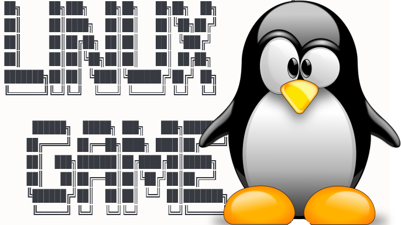

# 🐧 Linux Game



## 📋 Sobre o Projeto

**Linux Game** é um jogo educativo interativo desenvolvido em Python com Streamlit que ensina comandos Linux através de uma narrativa policial envolvente. 

Você assume o papel de um **🕵️ Detetive de Elite** em uma missão para capturar o vilão **🦹 Cálculus**, que hackeou os sistemas da cidade. Para derrotá-lo, você precisará dominar **170 comandos Linux** através de **17 fases progressivas**.

## 🎯 Características

- ✅ **170 comandos Linux** organizados pedagogicamente
- ✅ **17 fases temáticas** com dificuldade progressiva
- ✅ **Terminal autêntico** estilo MS-DOS (fundo preto, texto verde)
- ✅ **Narrativa policial** envolvente e motivadora
- ✅ **Sistema de dicas** com botão "Pedir Ajuda"
- ✅ **Certificado profissional** ao concluir todas as fases
- ✅ **Sidebar informativo** com progresso em tempo real
- ✅ **Auto-focus e scroll automático** para UX fluida
- ✅ **Gamificação educativa** sem pressão excessiva

## 🚀 Como Executar

### Pré-requisitos

- Python 3.8 ou superior
- pip (gerenciador de pacotes Python)

### Instalação

1. Clone o repositório:
```bash
git clone https://github.com/aryribeiro/linux-game.git
cd linux-game
```

2. Instale as dependências:
```bash
pip install -r requirements.txt
```

3. Execute o jogo:
```bash
streamlit run app.py
```

4. Acesse no navegador:
```
http://localhost:8501
```

## 📁 Estrutura de Arquivos

```
linux-game/
│
├── app.py                  # Aplicação principal Streamlit
├── comandos.json           # Base de dados com 170 comandos Linux
├── requirements.txt        # Dependências do projeto
├── README.md              # Este arquivo
│
└── static/
    ├── logo.png           # Logo do Linux Game
    └── assinatura.png     # Assinatura para certificado
```

## 🎮 Como Jogar

1. **Digite seu nome de Detetive** na tela inicial
2. **Clique em "Iniciar Missão"**
3. **Leia a dica** no painel lateral (sidebar)
4. **Tente lembrar** do comando Linux correto
5. **Digite o comando** no terminal e pressione ENTER
6. Se precisar de ajuda, clique em **"🆘 Pedir Ajuda"**
7. Complete todas as **17 fases** para capturar o Cálculus
8. **Baixe seu certificado** ao concluir!

## 📚 Fases do Jogo

1. **Primeiros Passos no Terminal** - Comandos básicos (ls, cd, pwd...)
2. **Investigando Arquivos** - Visualização e análise (cat, more, head...)
3. **Manipulação Avançada** - Copiar, mover, criar links
4. **Gerenciamento de Processos** - ps, top, kill
5. **Conexões de Rede** - ssh, ping, wget
6. **Busca e Pesquisa** - grep, locate, find
7. **Informações do Sistema** - uname, df, free
8. **Compactação e Arquivos** - tar, gzip
9. **Rede Avançada** - whois, dig
10. **Instalação de Software** - dpkg, rpm
11. **Hardware e Arquitetura** - lspci, dmidecode
12. **Armazenamento e Discos** - df, du
13. **Informações Detalhadas** - /proc, lsusb
14. **Data e Hora** - date, cal, uptime
15. **Controle de Sistema** - shutdown, reboot
16. **Navegação Avançada e Permissões** - chmod, chown
17. **Confronto Final** - Comandos avançados

## 🎓 Certificado

Ao completar todas as 170 comandos, você receberá um **certificado profissional** em PNG com:
- Logo oficial do Linux Game
- Seu nome em destaque
- Data de conclusão
- Carga horária equivalente (8 horas)
- Assinatura digital
- Download imediato

## 🛠️ Tecnologias Utilizadas

- **Python 3.8+** - Linguagem principal
- **Streamlit** - Framework web interativo
- **Pillow (PIL)** - Geração de certificados
- **JSON** - Armazenamento de comandos

## 🎨 Design

- **Tema:** Terminal MS-DOS retrô
- **Cores:** Verde fosforescente (#00FF00) sobre fundo preto (#000000)
- **Fonte:** Courier Prime (monoespaçada)
- **Layout:** Sidebar fixo + Terminal central

## 📊 Funcionalidades Técnicas

- ✅ Validação de comandos case-insensitive
- ✅ Normalização de espaços extras
- ✅ Histórico completo de comandos
- ✅ Persistência via `st.session_state`
- ✅ Scroll automático do terminal
- ✅ Auto-focus no campo de input
- ✅ Sistema de fases com narrativa dinâmica
- ✅ Geração de imagens com PIL

## 🤝 Contribuindo

Contribuições são bem-vindas! Para contribuir:

1. Faça um Fork do projeto
2. Crie uma branch para sua feature (`git checkout -b feature/NovaFuncionalidade`)
3. Commit suas mudanças (`git commit -m 'Adiciona nova funcionalidade'`)
4. Push para a branch (`git push origin feature/NovaFuncionalidade`)
5. Abra um Pull Request

## 📝 Licença

Este projeto está sob a licença MIT. Veja o arquivo `LICENSE` para mais detalhes.

## 👨‍💻 Autor

Desenvolvido com ❤️ para ensinar Linux de forma divertida e eficaz.

## 🌟 Agradecimentos

- Comunidade Linux
- Streamlit Team
- Todos os educadores que tornam o aprendizado mais acessível

## 📧 Contato

Para dúvidas, sugestões ou feedback:
- Ary Ribeiro
- Email: aryribeiro@gmail.com

---


**🐧 Divirta-se aprendendo Linux! 🕵️**
